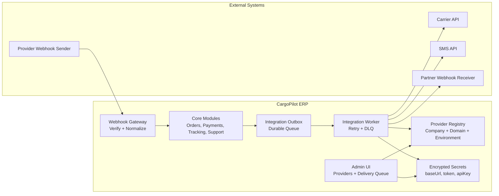
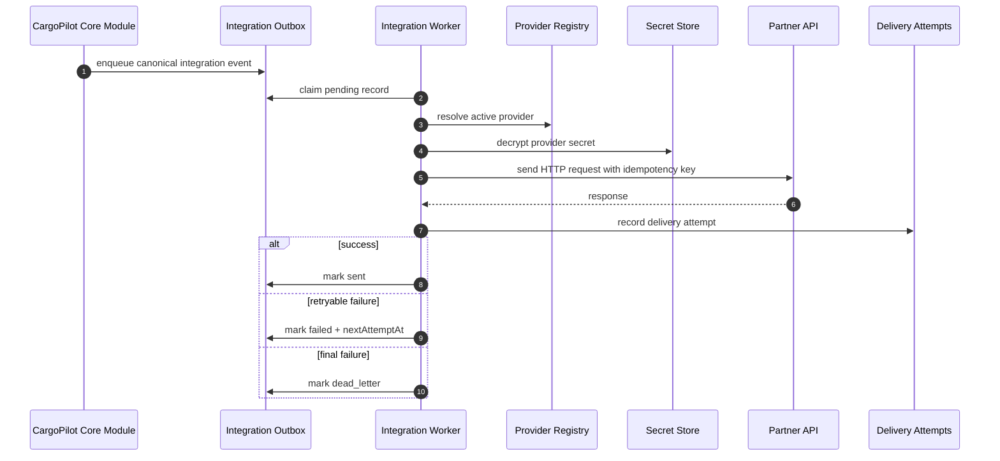
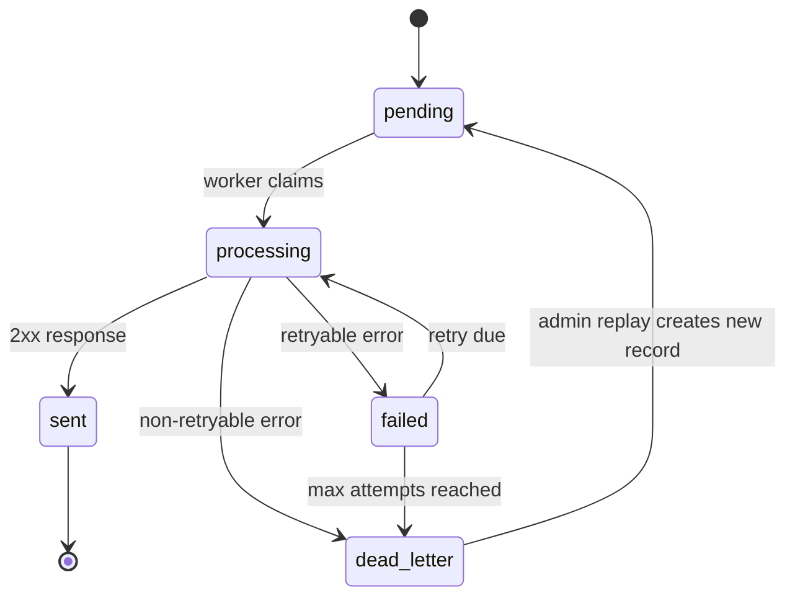
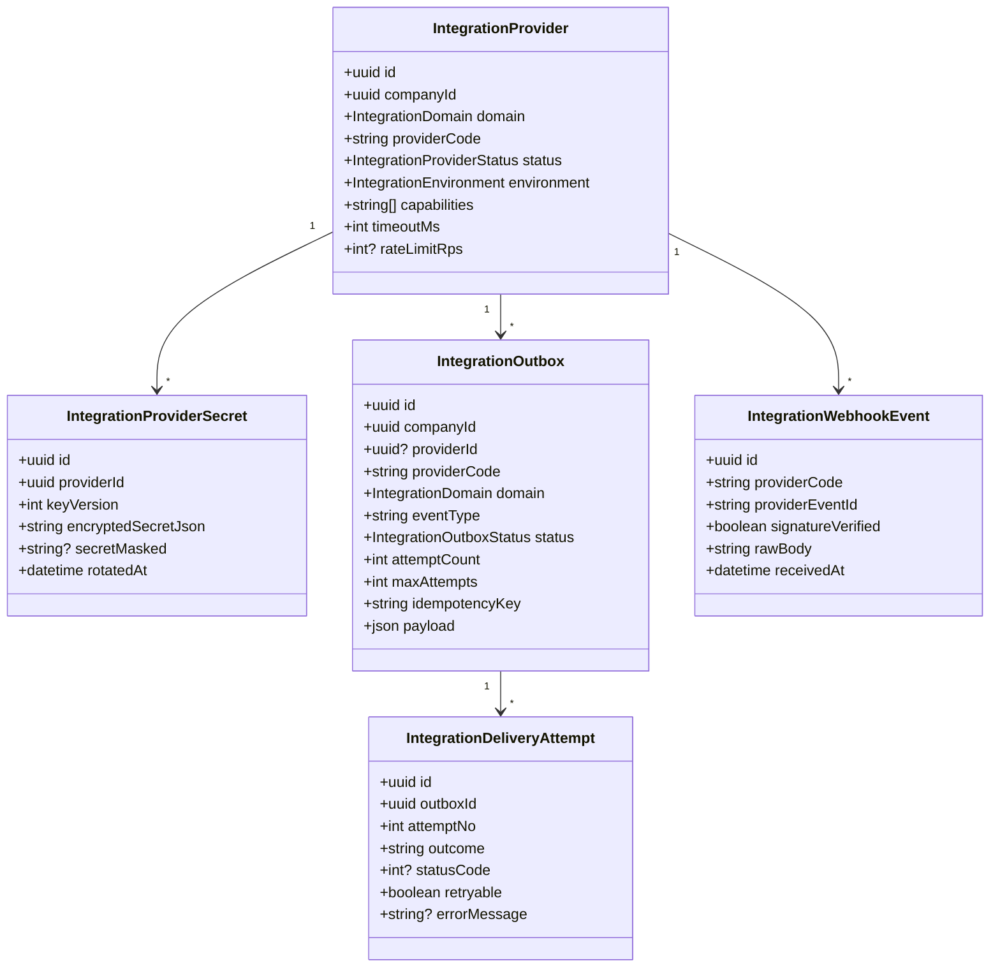

# CargoPilot Integration Partner Guide

Version: 1.0  
Audience: carrier partners, SMS providers, payment partners, enterprise clients, and implementation engineers.

## Purpose

CargoPilot uses a dedicated integration layer so external systems can connect without coupling directly to core ERP modules such as orders, pricing, payments, tracking, support, or warehouse operations.

The integration layer provides:

- Company-specific provider configuration.
- Encrypted provider credentials.
- Reliable outbound delivery with retries and dead-letter handling.
- Secure inbound webhook ingestion with signature verification and idempotency.
- Operational visibility for administrators.

## High-Level Architecture



## Core Concepts

### Integration Provider

An integration provider is a company-scoped external system configuration.

Example:

```json
{
  "companyId": "6efc7f6d-5c31-4c5f-81b9-651ad2bd63e3",
  "domain": "carrier",
  "providerCode": "dhl_express",
  "environment": "sandbox",
  "status": "active",
  "capabilities": ["create_shipment", "track"],
  "timeoutMs": 10000,
  "rateLimitRps": 10
}
```

Supported domains:

- `carrier`: shipment creation, cancellation, and tracking.
- `sms`: SMS send and delivery status.
- `payment`: reserved for payment provider convergence.
- `webhook_sink`: generic outbound webhook delivery to a partner endpoint.

Supported environments:

- `sandbox`
- `production`

Supported statuses:

- `active`: worker can dispatch to this provider.
- `paused`: configured but temporarily not used.
- `disabled`: not used.

### Integration Secret

Secrets are encrypted at rest and rotated through the admin API/UI.

Supported secret payload:

```json
{
  "baseUrl": "https://partner.example.com",
  "endpointUrl": "https://partner.example.com/webhooks/cargopilot",
  "token": "optional-bearer-token",
  "apiKey": "optional-api-key",
  "apiKeyHeader": "x-api-key"
}
```

Field usage:

- `baseUrl`: base URL for carrier/SMS APIs.
- `endpointUrl`: full URL for generic `webhook_sink` delivery.
- `token`: sent as `Authorization: Bearer <token>`.
- `apiKey`: sent in the configured API key header.
- `apiKeyHeader`: defaults to `x-api-key` when omitted.

### Integration Outbox

Every outbound integration event is first stored in the integration outbox. This prevents event loss when a partner API is unavailable.

Outbox statuses:

- `pending`: ready for worker pickup.
- `processing`: claimed by a worker.
- `sent`: delivered successfully.
- `failed`: failed but can be retried.
- `dead_letter`: retry budget exhausted or non-retryable failure.

### Delivery Attempt

Every dispatch attempt is persisted with request/response metadata, status code, retryability, and error message.

This gives operations and support teams a reliable audit trail.

## Outbound Delivery Flow



## Outbox State Machine



## Generic Carrier API Contract

If a carrier can support the CargoPilot generic carrier contract, no custom adapter is required. CargoPilot calls the configured `baseUrl` with the following endpoints.

### Headers Sent By CargoPilot

```http
content-type: application/json
x-cargopilot-request-id: <outbox-record-id>
x-cargopilot-company-id: <company-id>
x-idempotency-key: <stable-idempotency-key>
authorization: Bearer <token>              # when token is configured
x-api-key: <api-key>                       # when apiKey is configured
```

If `apiKeyHeader` is configured, CargoPilot sends the API key using that header name instead of `x-api-key`.

### Create Shipment

Request:

```http
POST /shipments
```

```json
{
  "externalOrderId": "990000000123",
  "sender": {
    "name": "Sender Name",
    "phone": "+998901234567",
    "address": "Tashkent, Uzbekistan",
    "lat": 41.311081,
    "lng": 69.240562
  },
  "receiver": {
    "name": "Receiver Name",
    "phone": "+998909876543",
    "address": "Almaty, Kazakhstan",
    "lat": 43.238949,
    "lng": 76.889709
  },
  "parcels": [
    {
      "weightKg": 2.5,
      "quantity": 1,
      "description": "Documents"
    }
  ],
  "declaredValueMinor": "1200000",
  "currency": "UZS",
  "transportMode": "air",
  "serviceCode": "express",
  "metadata": {
    "source": "cargopilot"
  }
}
```

Successful response:

```json
{
  "partnerShipmentId": "DHL-123456789",
  "trackingNumber": "JD014600011234567890",
  "labelUrl": "https://partner.example.com/labels/JD014600011234567890.pdf"
}
```

Required response field:

- `partnerShipmentId`

Optional accepted aliases:

- `shipmentId`
- `id`

### Cancel Shipment

Request:

```http
POST /shipments/{partnerShipmentId}/cancel
```

```json
{
  "reason": "Customer requested cancellation"
}
```

Successful response:

```json
{
  "ok": true
}
```

### Track Shipment

Request by partner shipment ID:

```http
GET /shipments/{partnerShipmentId}/track
```

Request by tracking number:

```http
GET /shipments/track?trackingNumber=JD014600011234567890
```

Successful response:

```json
{
  "statusCode": "in_transit",
  "statusLabel": "In transit",
  "happenedAt": "2026-06-03T12:00:00.000Z",
  "location": "Almaty Hub"
}
```

Accepted aliases:

- Status code: `statusCode`, `status`, `code`
- Status label: `statusLabel`, `statusText`, `label`
- Timestamp: `happenedAt`, `updatedAt`, `timestamp`
- Location: `location`, `city`, `place`

## Generic SMS API Contract

If an SMS provider can support the CargoPilot generic SMS contract, no custom adapter is required.

### Send SMS

Request:

```http
POST /messages
```

```json
{
  "to": "+998901234567",
  "text": "Your shipment 990000000123 is ready.",
  "templateCode": "shipment_ready",
  "metadata": {
    "orderId": "990000000123"
  }
}
```

Successful response:

```json
{
  "messageId": "sms_123456",
  "acceptedAt": "2026-06-03T12:00:00.000Z"
}
```

Required response field:

- `messageId`

Optional accepted alias:

- `id`

### Get SMS Delivery Status

Request:

```http
GET /messages/{messageId}
```

Successful response:

```json
{
  "status": "delivered",
  "deliveredAt": "2026-06-03T12:00:30.000Z"
}
```

Accepted aliases:

- Status: `status`, `deliveryStatus`, `state`
- Timestamp: `deliveredAt`, `updatedAt`, `timestamp`

## Generic Webhook Sink Contract

For `webhook_sink` providers, CargoPilot sends the outbox event payload to the configured `endpointUrl`.

Headers sent:

```http
content-type: application/json
x-cargopilot-provider-code: <provider-code>
x-cargopilot-idempotency-key: <idempotency-key>
x-cargopilot-event-type: <event-type>
authorization: Bearer <token>              # when token is configured
x-api-key: <api-key>                       # when apiKey is configured
```

CargoPilot treats any `2xx` response as successful.

Retryable responses:

- `429`
- Any `5xx`
- Network timeout
- Connection reset
- DNS temporary failure
- Connection refused

Non-retryable responses:

- Most `4xx` responses except `429`
- Invalid endpoint URL
- Missing required provider config

## Inbound Webhook Contract

Partners can notify CargoPilot through the generic webhook gateway.

Endpoint:

```http
POST /api/integrations/webhooks/{providerCode}
```

Required headers:

```http
content-type: application/json
x-signature: <hmac-signature>
x-signature-timestamp: <unix-timestamp-seconds-or-ms>
```

Optional headers:

```http
x-company-id: <company-id>
x-webhook-signature: <hmac-signature-alias>
x-timestamp: <timestamp-alias>
```

Signature algorithm:

```txt
signed_payload = "<timestamp>.<raw_body>"
signature = HMAC_SHA256_HEX(secret, signed_payload)
```

If no timestamp header is used:

```txt
signed_payload = "<raw_body>"
signature = HMAC_SHA256_HEX(secret, signed_payload)
```

Accepted signature formats:

```txt
<hex>
sha256=<hex>
v1=<hex>
<base64-of-hmac>
```

Default timestamp drift window:

```txt
300 seconds
```

### Webhook Payload

Recommended payload:

```json
{
  "eventId": "evt_123456",
  "eventType": "carrier.status.updated",
  "occurredAt": "2026-06-03T12:00:00.000Z",
  "companyId": "6efc7f6d-5c31-4c5f-81b9-651ad2bd63e3",
  "aggregateType": "shipment",
  "aggregateId": "DHL-123456789",
  "payload": {
    "trackingNumber": "JD014600011234567890",
    "statusCode": "delivered",
    "statusLabel": "Delivered",
    "location": "Tashkent"
  }
}
```

Accepted aliases:

- Event ID: `eventId`, `event_id`, `id`, `webhookEventId`
- Event type: `eventType`, `event_type`, `type`
- Occurred at: `occurredAt`, `occurred_at`, `createdAt`, `timestamp`
- Company ID: `companyId`, `company_id`, `orgId`, `organizationId`
- Aggregate type: `aggregateType`, `aggregate_type`, `resource`, `entity`
- Aggregate ID: `aggregateId`, `aggregate_id`, `resourceId`, `resource_id`, `entityId`, `entity_id`, `orderId`, `order_id`, `shipmentId`, `shipment_id`, `paymentIntentId`, `payment_intent_id`

### Webhook Responses

Accepted:

```json
{
  "status": "accepted",
  "eventId": "uuid"
}
```

Duplicate:

```json
{
  "status": "duplicate",
  "eventId": "uuid"
}
```

Rejected:

```json
{
  "status": "rejected",
  "message": "Webhook signature mismatch"
}
```

## Idempotency Rules

Partners must treat `x-idempotency-key` as a stable key for the same business operation.

CargoPilot expects:

- Repeating the same idempotency key must not create duplicate shipments, messages, invoices, or payments.
- If the first request succeeded but the response was lost, the repeated request should return the same business reference.
- For webhooks, partner `eventId` must be stable and globally unique per provider.

## Reliability Rules

CargoPilot retries outbound records when the failure is considered temporary.

Partner systems should:

- Return `2xx` only after accepting the operation.
- Return `409` only for a real business conflict.
- Return `429` when rate limited.
- Return `5xx` for temporary platform/provider errors.
- Avoid returning `2xx` for failed business operations.

## Security Requirements

Partners must implement:

- HTTPS in production.
- Stable idempotency handling.
- Secret rotation support.
- Webhook HMAC signing when sending events to CargoPilot.
- No sensitive values in URLs.
- No card data, personal documents, or passwords in webhook payloads.

CargoPilot implements:

- Provider credentials encrypted at rest.
- RBAC-protected provider management.
- Signature verification before webhook processing.
- Timestamp drift validation.
- Duplicate webhook detection.
- Delivery attempt audit trail.

## UML Class View



## Partner Onboarding Checklist

1. Agree on domain: `carrier`, `sms`, `payment`, or `webhook_sink`.
2. Agree on environment: `sandbox` first, then `production`.
3. Decide whether the generic CargoPilot contract is enough or a custom adapter is required.
4. Exchange sandbox credentials and webhook secret.
5. Configure provider in CargoPilot admin UI.
6. Send test outbound request.
7. Send signed inbound webhook test.
8. Verify idempotency behavior.
9. Verify retry and duplicate handling.
10. Approve production cutover.

## When A Custom Adapter Is Required

A custom adapter is required when a partner API cannot match the generic contract.

Examples:

- Different endpoint paths that cannot be mapped to `/shipments` or `/messages`.
- OAuth/token refresh flows.
- XML/SOAP payloads.
- Provider-specific signature schemes.
- Multi-step shipment creation.
- File upload/download flows for labels or manifests.
- Strict provider-specific status code mapping.

In that case, CargoPilot should implement a dedicated adapter inside `integrations-core` while keeping orders, pricing, payments, and tracking provider-agnostic.

## Operational Ownership

CargoPilot administrators own:

- Provider activation status.
- Environment selection.
- Credential rotation.
- Delivery queue inspection.
- Retry and replay of failed records.

Partners own:

- API availability.
- Correct idempotency behavior.
- Correct webhook signatures.
- Stable event IDs.
- Clear error responses.

## Production Readiness Criteria

Before production, every integration should pass:

- Sandbox create shipment or send SMS test.
- Webhook signature verification test.
- Duplicate webhook test.
- Retry behavior test using temporary `5xx` or timeout.
- Idempotency replay test.
- Secret rotation test.
- Admin disable/pause test.
- Production credentials loaded and verified.
